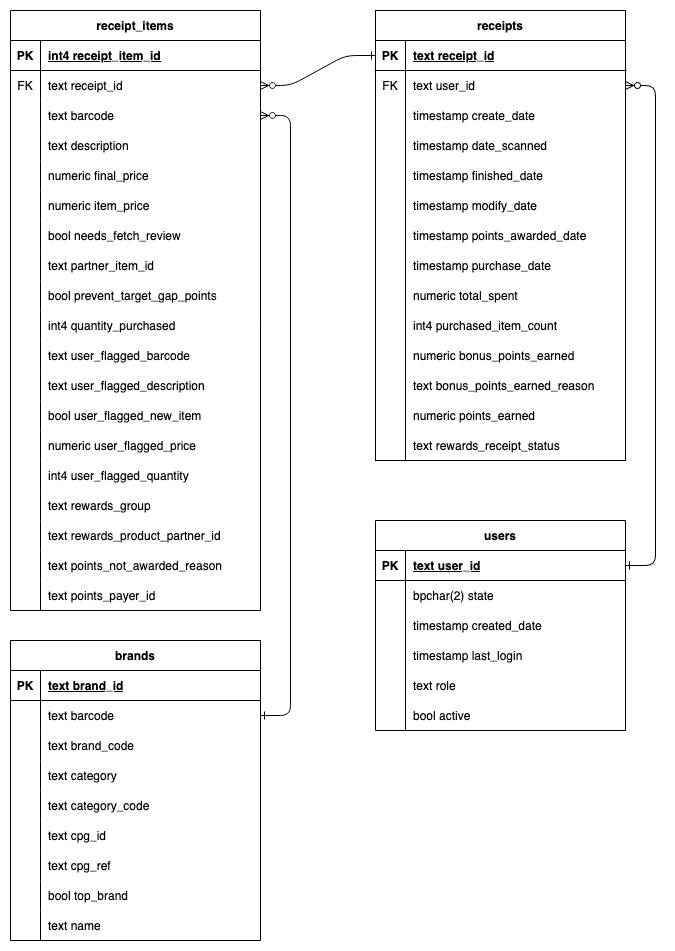

# Fetch Rewards Coding Exercise - Analytics Engineer

I loaded the data into PostgreSQL using Python, then did all the work in SQL.

## 1. Data Diagram
Notes: I split receipt_items out into its own table.  I included all the columns available in the JSON.

The following diagram represents the structured relational data model designed based on the unstructured JSON data.

## 2. SQL Queries

Before I went about answering the questions, I dove into the data and did some minor cleanup.  You can see how I explored the data in the .sql files in the /sql/notes folder.  I was able to answer 2 questions at a time with each query.  The SQL I used to get the answers is in answers.sql.

### Questions 1 & 2:
#### What are the top 5 brands by receipts scanned for most recent month?
#### How does the ranking of the top 5 brands by receipts scanned for the recent month compare to the ranking for the previous month?

These were the hardest questions to answer because the barcodes from our receipt_items didn't have matches in our brands table.  Like a good analytics engineer I found a way to come up with an answer using fuzzy matching between the rewards_group column in receipt_items and the brand_code column in brands.

Note: For most recent month I used 2021-02 because 2021-03 only had 1 day of data.  I used total_spent as a tie-breaker due to a low number of total receipts for February.

#### Answer:

| top_5_february | receipts_february | top_5_january | receipts_january |
|---------------|------------------|---------------|------------------|
| SARGENTO     | 5                | SARGENTO      | 63               |
| DORITOS      | 3                | ONE           | 42               |
| CAPRI SUN    | 2                | DORITOS       | 32               |
| SUAVE        | 2                | HUGGIES       | 28               |
| HEINZ        | 1                | KNORR         | 27               |

### Questions 3 & 4:
#### When considering average spend from receipts with 'rewardsReceiptStatus’ of ‘Accepted’ or ‘Rejected’, which is greater?
#### When considering total number of items purchased from receipts with 'rewardsReceiptStatus’ of ‘Accepted’ or ‘Rejected’, which is greater?

This was a simple one.  Note that 'Accepted' was not a valid data point, so I assumed 'FINISHED' was what we wanted instead.

#### Answer:

| rewards_receipt_status | avg_spend       | total_items_purchased |
|------------------------|----------------|----------------------|
| FINISHED              | 80.85           | 8184                 |
| REJECTED              | 23.33           | 173                  |

### Questions 5 & 6:
#### Which brand has the most spend among users who were created within the past 6 months?
#### Which brand has the most transactions among users who were created within the past 6 months?

Note: The most recent user creation date was 2021-02-12, so I used that as the baseline and counted 6 months back from there.  I used the same fuzzy matching I used for questions 1 and 2 to connect to the brands.

#### Answer:

| top_spend_brand | total_spend | top_transaction_brand | total_transactions |
|----------------|------------|----------------------|--------------------|
| PEPSI         | 88432.81   | SARGENTO             | 45                 |

## 3. Data Quality

There were lots of minor data quality issues I found: NULL values, duplicates, running totals not matching with explicit totals, almost all users coming from one state, etc. You can see what I was looking for in the /sql/notes folder.

For the purposes of this question though, I want to focus on what I consider to be the major key data quality issue: **reliably connecting receipts to brands.** 

Highlighted in data_quality.sql, we are missing or not matching on key data points that would allow us to unlock the real value of this data. Almost all of receipt items fail to link to a brand due to missing or inconsistent barcode data. This means that brand-level insights—like tracking spend per brand or measuring customer loyalty—will be incomplete. 

Based on the questions from Section 2 and what I implicitly perceive to be the real marketable value of data like this, we need to find a way to reliably connect users’ receipt data with brands—this is what advertisers and clients would want. If increasing the integrity of the connecting data points is not possible, an AI-driven approach (such as text-matching rewards_group to brand_code) could be a way forward.

